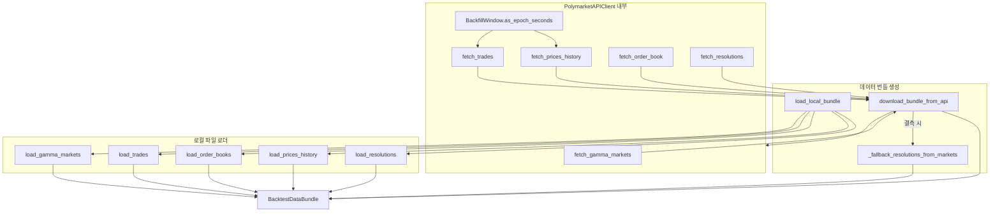
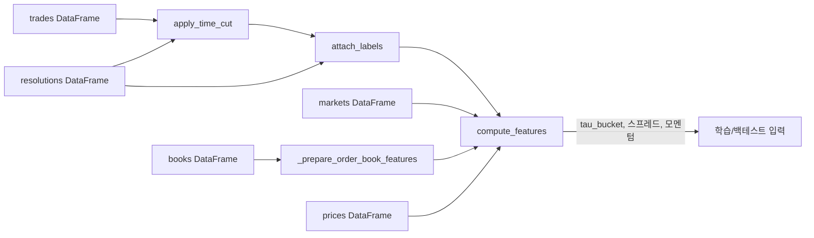
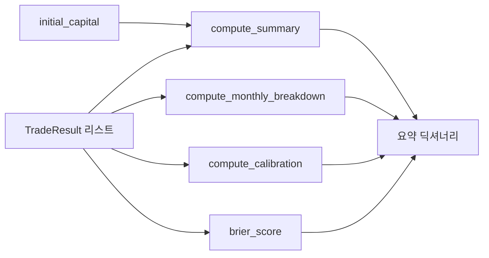

# 시스템 아키텍처 개요

이 문서는 `run_backtest.py`가 조립하는 폴리몰리(Polymoly) 백테스트 파이프라인의 구조를 모듈 단위로 정리한다. 각 섹션에는 주요 데이터 흐름과 객체 관계를 묘사하는 Mermaid 다이어그램을 포함했다.

## 전체 파이프라인 흐름

`run_backtest` 함수는 데이터 소스 확인부터 리포트 산출까지의 모든 단계를 orchestration 한다. 아래 다이어그램은 주요 처리 단계를 시간 순으로 보여준다.

```mermaid
flowchart LR
    subgraph Source[데이터 소스]
        Local[로컬 CSV/JSON\n(load_local_bundle)]
        API[Polymarket API\n(download_bundle_from_api)]
    end
    subgraph Preprocess[전처리 계층]
        EnsureBooks[_ensure_books\n(_synthesise_books)]
        EnsurePrices[_ensure_prices]
        Labels[attach_labels]
        Features[compute_features]
    end
    subgraph Backtest[백테스트 계층]
        Lookup[_build_book_lookup]
        Engine[BacktestEngine.run]
        Calibrator[IsotonicCalibrator]
        CostModel[CostModel]
        Risk[RiskManager]
    end
    subgraph Report[리포트 계층]
        Summary[compute_summary]
        Monthly[compute_monthly_breakdown]
        Calibration[compute_calibration]
        Brier[brier_score]
    end

    Local --> Bundle[BacktestDataBundle]
    API --> Bundle
    Bundle --> EnsureBooks
    Bundle --> EnsurePrices
    Bundle --> Labels
    Labels --> Features
    EnsureBooks --> Lookup
    Features --> Engine
    Lookup --> Engine
    Engine --> Summary
    Engine --> Monthly
    Engine --> Calibration
    Engine --> Brier
    Engine -. 학습/예측 .-> Calibrator
    Engine -. 체결비용 .-> CostModel
    Engine -. 리스크한도 .-> Risk
```

## 인제스트(ingest) 모듈 구성

`ingest` 패키지는 로컬 샘플 파일과 실시간 API를 동일한 `BacktestDataBundle` 스키마로 맞춘다. API 경로별로 세분화된 로더가 존재하며, 결측 데이터가 있을 경우 보정 유틸리티가 동작한다.



## 라벨 및 피처 생성 계층

라벨링과 피처링은 각각 `feature.make_labels`와 `feature.make_features` 모듈에 집중되어 있다. 타임컷, 주문호가, 모멘텀 등이 한 번에 계산된다.



## 백테스트 엔진 내부 동작

`BacktestEngine`은 워크포워드 분할별로 캘리브레이터를 학습시키고, 주문 비용/리스크 제약을 고려해 체결을 모사한다. 주요 상호작용은 아래와 같다.

```mermaid
flowchart TB
    subgraph Preparation[준비 단계]
        FeatureSet[피처 DataFrame]
        Splits[워크포워드 구간]
        BookLookup[_build_book_lookup]
    end

    FeatureSet --> Fit[IsotonicCalibrator.fit]
    Fit --> Predict[IsotonicCalibrator.transform]
    Predict --> Iterate[BacktestEngine.run\n(테스트 루프)]
    Splits --> Iterate
    BookLookup --> Iterate

    subgraph TradeLoop[단일 체결 절차]
        Settle[_settle_positions]
        Kelly[RiskManager.kelly_fraction]
        Limits[RiskManager.available_notional]
        Cost[CostModel.estimate_cost]
        Adjust[사이즈 재산출]
        Record[RiskManager.register_position]
        Release[RiskManager.release_position]
        Result[TradeResult 기록]
    end

    Iterate --> Settle
    Iterate --> Kelly
    Kelly --> Limits
    Limits --> Cost
    Cost --> Adjust
    Adjust --> Record
    Record --> Result
    Result -->|만기 시| Release
    Release --> Settle
    Result --> Output[executed_trades, capital_history]
```

## 리포트 및 메트릭 산출

리포트 계층은 `report.metrics`의 함수들로 구성되어 있으며, 백테스트 결과를 요약 지표와 분해 테이블로 제공한다.



각 다이어그램의 노드는 실제 함수/클래스명을 반영하며, 모듈 간 데이터 이동과 의존 관계를 세밀하게 표현하였다.
