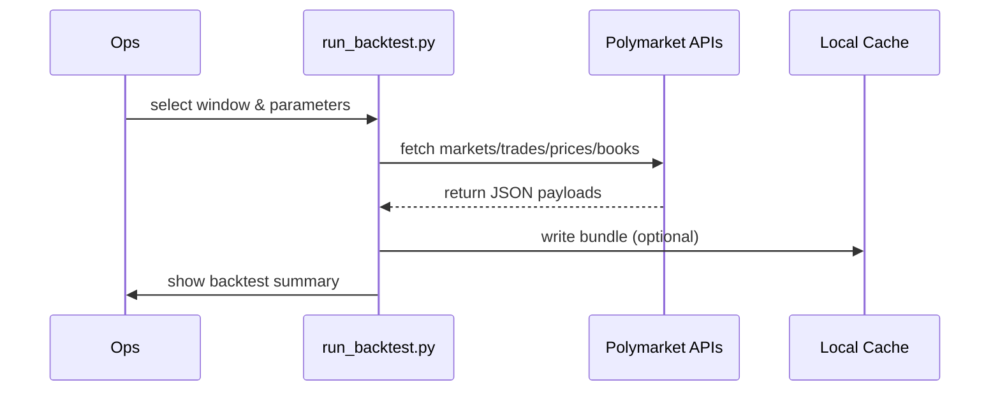
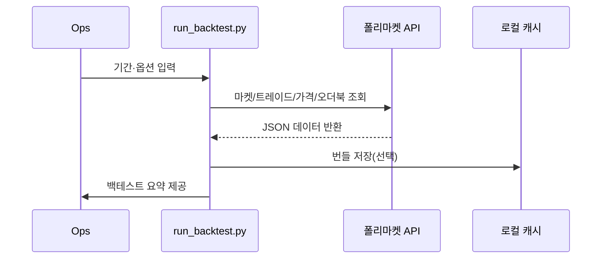

# Data Operations · 데이터 운영 가이드

## English
- Goal: help operations staff refresh historical datasets without touching Python internals.
- Prerequisites: Python 3.11+, `pip install -r requirements.txt`, Goldsky GraphQL URL for resolutions.
- Typical refresh:
  1. Choose a window, e.g. `--start 2024-01-01 --end 2024-04-01`.
  2. Run ``python run_backtest.py --source api --goldsky-url <URL> --start ... --end ...``.
  3. Review the CLI summary or extend the script to write CSV outputs for archives.

- Troubleshooting cues:
  - "Failed to download resolution data" ⇒ provide `--goldsky-url` or check credentials.
  - Empty trade set ⇒ widen the date window or verify condition ids.
  - Synthetic books warning ⇒ schedule real-time book archiving for higher fidelity.

## 한국어
- 목적: 운영 담당자가 파이썬 코드를 수정하지 않고도 히스토리컬 데이터를 새로 확보하도록 돕습니다.
- 준비물: Python 3.11 이상, `pip install -r requirements.txt`, 결제 확인용 Goldsky GraphQL URL.
- 표준 갱신 절차:
  1. 수집 구간을 정합니다. 예) `--start 2024-01-01 --end 2024-04-01`.
  2. ``python run_backtest.py --source api --goldsky-url <URL> --start ... --end ...`` 명령을 실행합니다.
  3. CLI 요약을 검토하고 필요하면 스크립트를 확장해 CSV를 저장합니다.

- 문제 해결 팁:
  - "Failed to download resolution data" 메시지 ⇒ `--goldsky-url` 값을 지정하거나 접근 권한을 확인합니다.
  - 트레이드가 비어 있음 ⇒ 날짜 범위를 넓히거나 condition id 설정을 재검토합니다.
  - 합성 오더북 경고 ⇒ 고정밀 검증용으로 실시간 오더북 기록을 스케줄링하세요.
