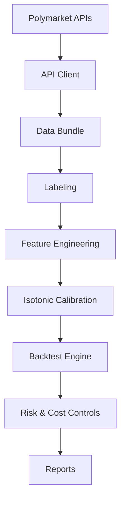
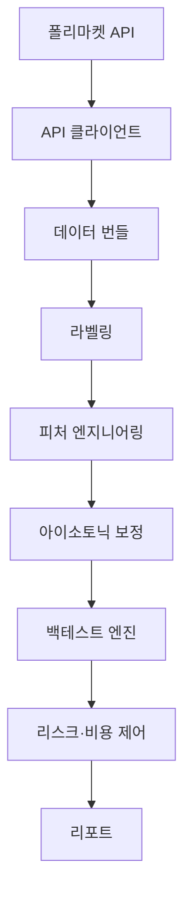

# Pipeline Overview · 파이프라인 개요

## English
- Purpose: turn public Polymarket data into a calibrated favorites backtest that a risk analyst can replay end-to-end.
- Flow: backfill raw data → enforce outcome labels → build features → calibrate probabilities → simulate execution → aggregate reports.
- Safety: every step keeps timestamps in UTC, avoids look-ahead bias, and enforces position caps before measuring returns.

- Outputs: capital curve, calibration table, monthly PnL, and summary statistics suitable for investment memos.
- How to run: ``python run_backtest.py --source api --start 2024-01-01T00:00:00Z --end 2024-03-31T23:59:59Z --goldsky-url <GraphQL URL>``.

## 한국어
- 목적: 폴리마켓 공개 데이터를 받아 즐겨찾기 전략용 백테스트를 전 과정으로 재현할 수 있게 구성합니다.
- 흐름: 원천 데이터 백필 → 결말 라벨링 → 특징 생성 → 확률 보정 → 체결 시뮬레이션 → 리포트 집계 순으로 진행됩니다.
- 안전장치: 모든 단계는 UTC 타임스탬프를 사용하고, 타임컷으로 정보누출을 막으며, 포지션 한도를 선적용한 뒤 수익률을 계산합니다.

- 산출물: 자본 곡선, 칼리브레이션 표, 월별 손익, 투자 메모용 핵심 지표.
- 실행 예시: ``python run_backtest.py --source api --start 2024-01-01T00:00:00Z --end 2024-03-31T23:59:59Z --goldsky-url <GraphQL URL>``.
